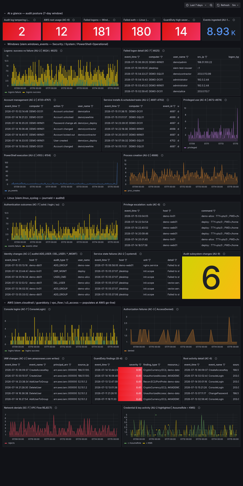
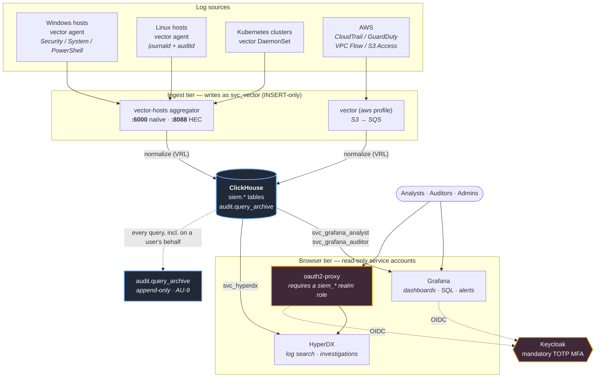

# Self-hosted, license-free SIEM

A NIST 800-53-oriented SIEM built entirely from free/open components:
**ClickHouse** for storage and SQL, **Vector** for all collection, **Grafana
OSS** for dashboards and alerting, **HyperDX** for log search, **Keycloak**
for SSO with mandatory TOTP MFA. No ingest caps, no license keys, no
phone-home, no per-seat pricing.

The project exists because commercial/openish alternatives gate the
compliance-critical features (SSO, RBAC, audit trails, >50 GB/day) behind paid
tiers. Here, the audit evidence *is* the product: every design choice traces
to an AU-family control in [docs/control-mapping.md](docs/control-mapping.md).

## Dashboard

The weekly ISSO review dashboard (shown populated with synthetic demo data):
at-a-glance control tripwires across the top — audit-log tampering (AU-9), root
usage (AC-6), failed logons (AC-7), high-severity GuardDuty (SI-4) — then
Windows, Linux, and AWS sections covering every AU-2-committed event family,
each panel tagged with its control ID. Querying: [docs/query-guide.md](docs/query-guide.md).

## Architecture

Every human enters through Keycloak. Every query any UI runs is captured in
`audit.query_archive` (AU-9). Ingest happens only through the write-only
`svc_vector` account; analysts can never write, auditors can also read the
analyst-activity trail.

## Components

| Service | Image (pinned) | License | Role |
|---|---|---|---|
| clickhouse | clickhouse/clickhouse-server:24.8 | Apache-2.0 | storage, SQL, RBAC, audit trail |
| keycloak (+postgres 16) | quay.io/keycloak/keycloak:26.0 | Apache-2.0 | SSO, mandatory TOTP MFA |
| grafana | grafana/grafana-oss:11.4.0 | AGPL-3.0 | dashboards, AU-5 alerting |
| hyperdx (+mongo 7.0) | docker.hyperdx.io/hyperdx/hyperdx:2.19.0 | MIT | log search / investigations UI |
| hyperdx-auth | quay.io/oauth2-proxy/oauth2-proxy:v7.15.3 | Apache-2.0 | Keycloak SSO gate for HyperDX |
| vector-hosts | timberio/vector:0.57.0-debian | MPL-2.0 | host/K8s ingestion (always on) |
| vector | timberio/vector:0.57.0-debian | MPL-2.0 | AWS ingestion (profile `aws`) |
| k3s (demo) | rancher/k3s:v1.35.6-k3s1 | Apache-2.0 | local test cluster (profile `k3s`) |

License note: MongoDB (HyperDX app-state only — no audit data) is SSPL: free
to self-host, no caps or keys, not OSI-approved; accepted and documented in
control-mapping.

## Repository layout

    docker-compose.yml           the whole platform
    bootstrap.sh                 one-command fresh install
    .env.example                 every secret/setting, annotated
    clickhouse/
      ddl/                       schemas, audit trail, RBAC (auto-applied on first start)
      config.d/ users.d/         listen config, query_log, default-user lockdown
      initdb/99-init.sh          applies DDL + creates service accounts
    vector/
      vector.yaml                AWS pipelines (CloudTrail/GuardDuty/VPCFlow/S3)
      hosts.yaml                 host+K8s aggregator (HEC :8088, native :6000)
      agent-linux.yaml           drop-in config for Linux hosts
      agent-windows.yaml         drop-in config for Windows hosts
      tests.yaml tests-hosts.yaml  VRL unit tests
    k8s/
      vector-shipper.yaml        DaemonSet manifest for any cluster
      k3s-demo-up.sh             one-command local demo cluster
    scripts/
      install-windows-agent.ps1  elevated Windows agent installer
      fix-windows-agent-addr.ps1 WSL-lab address fix + boot task
    grafana/provisioning/        datasources, dashboards, AU-5 alert rules
    keycloak/realm-export/       "siem" realm: MFA, roles, OIDC clients
    docs/                        OKF v0.1 knowledge bundle (runbooks, policies, catalog)
    scripts/okf-validate.py      OKF conformance checker for docs/

    --- appliance build (Phase 8) ---
    packer/                      HCL2 build: RHEL 9 (shipping) / Rocky 9 (dev)
    quadlets/                    podman systemd units — the compose stack, without compose
    scripts/ami/                 build-time: partitioning, baseline, STIG, FIPS, cleanup
    scripts/firstboot/           launch-time: config resolution, schema reconciliation

## UIs

| URL | What | Auth |
|---|---|---|
| http://localhost:3000 | Grafana — dashboards, SQL (Explore), alerts | Keycloak SSO + TOTP |
| http://localhost:8081 | HyperDX — log search, investigations | Keycloak SSO first (oauth2-proxy), then HyperDX local account |
| http://keycloak:8080 | Keycloak admin console | kcadmin (see .env) |

Browser prerequisite: `127.0.0.1 keycloak` in the hosts file so the browser
and containers agree on the Keycloak hostname (admin PowerShell:
`Add-Content $env:SystemRoot\System32\drivers\etc\hosts "127.0.0.1 keycloak"`).

On the **appliance** the same three UIs are published on the same ports, but at
`APPLIANCE_FQDN` instead of localhost — no hosts-file entry, because Keycloak is
reached by the appliance's own FQDN. ClickHouse (`:8123`/`:9000`) stays bound to
loopback in both deployments and is never published.

Dashboards (Grafana -> SIEM folder):
- **800-53 Logging Evidence — Weekly ISSO Review**: the weekly audit pass —
  at-a-glance posture stats (tampering, root usage, failed auth, GuardDuty),
  then Windows / Linux / AWS sections with every AU-2-committed event family,
  control IDs in each panel title.
- **AWS Security Overview**: console logins, AccessDenied trend, root
  activity, IAM writes.
- **Pipeline Health (AU-5)**: per-source ingest lag + rate.

New to querying? Start with [docs/query-guide.md](docs/query-guide.md).

## Fresh install

1. Prereqs: Docker Engine + compose v2, bash, openssl. (This lab runs Docker
   CE inside WSL2 Ubuntu — no Docker Desktop.)
2. `./bootstrap.sh you@example.com` — generates `.env` (all secrets), starts
   the stack, rotates the Grafana + HyperDX OIDC client secrets, creates your
   admin user (temp password printed once), verifies RBAC.
3. Add the hosts entry (above), open http://localhost:3000, log in, set a new
   password, enroll TOTP.
4. Visit http://localhost:8081, pass Keycloak, register the HyperDX local
   account — its ClickHouse connection + sources auto-provision at that moment.
5. Onboard data sources (next section).

`bootstrap.sh` refuses to overwrite an existing `.env`. Fully wipe with
`docker compose down -v` (destroys data).

## Deploy as an EC2 AMI appliance

The same stack also ships as a single self-contained EC2 image that runs in any
AWS partition (commercial, GovCloud, C2S/SC2S). No compose, no internet at
launch: every container image is baked in, and podman systemd units
(`quadlets/`) replace `docker-compose.yml` one-for-one.

1. Build: `cd packer && packer build -var "build_git_sha=$(git rev-parse --short HEAD)" .`
   Use `-only=ironlog.amazon-ebs.rhel9` for anything shipping or
   compliance-touching; the `rocky9` source is for development only and its
   STIG/FIPS output is functional evidence, not audit evidence.
2. Launch with the appliance config as **EC2 user-data** (see
   [scripts/firstboot/appliance.conf.example](scripts/firstboot/appliance.conf.example)).
   First boot **hard-fails by design** if no config is found — an unconfigured
   appliance refuses to start rather than come up with default credentials.
3. Every value is a literal, or `ssm://`, `asm://`, `file:///` (air-gapped
   enclaves), or `generate:<bytes>`. Nothing secret is baked into the AMI.
4. Register the HyperDX local account as in step 4 above.

What first boot does: resolves secrets, derives the Keycloak/Grafana URLs from
`APPLIANCE_FQDN` + `APPLIANCE_TLS`, mounts the data volume at
`/var/lib/ironlog`, then reconciles the ClickHouse schema and service accounts
**on every boot** (`ironlog-schema.service`) — all DDL is
`CREATE ... IF NOT EXISTS`, and the unit fails loudly with recovery
instructions if the 7 `siem.*` tables, `audit.query_archive` and 4 service
accounts aren't all present afterwards.

Disk layout is STIG-shaped: separate LVs for `/home`, `/var`, `/var/log`,
`/var/log/audit`, `/var/tmp`, `/tmp`, with SIEM data on its own EBS volume at
`/var/lib/ironlog`. FIPS mode is enabled at build time and the build fails if
`fips=1` isn't live on the rebooted kernel.

Details: [packer/README.md](packer/README.md),
[scripts/firstboot/README.md](scripts/firstboot/README.md),
[quadlets/README.md](quadlets/README.md).

## Data source onboarding

| Source | Status here | Runbook |
|---|---|---|
| Linux hosts (journald+auditd) | LIVE (WSL host) | [docs/host-ingestion.md](docs/host-ingestion.md) |
| Kubernetes (any cluster, HEC) | LIVE (local k3s demo) | same |
| Windows (Security/System/PowerShell) | LIVE (this machine, idle-freeze pilot) | same |
| AWS CloudTrail/GuardDuty/VPCFlow/S3 | staged — needs account wiring | [docs/aws-ingestion.md](docs/aws-ingestion.md) |

AWS go-live: follow the runbook (S3 -> SQS -> least-privilege IAM), fill the
Phase 2 block in `.env`, uncomment `COMPOSE_PROFILES=aws`, `docker compose up
-d`, then un-pause the four AWS alert rules (Alerting -> AU-5 pipeline health).

## Security model

- **Authentication**: everything human-facing sits behind Keycloak (realm
  `siem`) with TOTP enrollment forced on first login. Grafana local login is
  disabled; HyperDX (no native SSO in OSS) is unreachable except through
  oauth2-proxy, which requires a `siem_*` realm role.
- **Authorization** (ClickHouse enforces, not the UIs):

  | Account | Can | Cannot |
  |---|---|---|
  | svc_vector | INSERT siem.* | read anything |
  | svc_grafana_analyst / svc_hyperdx | SELECT siem.* | write; read audit.* |
  | svc_grafana_auditor | SELECT siem.* + audit.* | write |
  | siem_admin (bootstrap) | everything | — |

  Realm roles map to Grafana roles (siem_admin→Admin, siem_analyst→Editor,
  siem_auditor→Viewer). Readers run under a settings profile: SELECT-only,
  8 GB / 120 s / 20B-rows per query.
- **Audit trail (AU-9)**: an incremental MV copies every finished query from
  system.query_log into append-only `audit.query_archive` (2-year TTL) —
  including every query Grafana and HyperDX run on anyone's behalf.
- **Network**: ClickHouse/native+HTTP bound to localhost on the host; the
  in-container `default` user is loopback-confined; ingest listeners (:6000,
  :8088) are token/marker-validated at the aggregator and write-only at the DB.
- **Secrets**: all in `.env` (git-ignored, chmod 600), generated by bootstrap;
  Keycloak client secrets rotated out of the realm-export placeholders.

## Compliance surface

The `docs/` directory is an [Open Knowledge Format](https://github.com/GoogleCloudPlatform/knowledge-catalog/blob/main/okf/SPEC.md)
(OKF v0.1) knowledge bundle — every doc carries YAML frontmatter (`type`,
`title`, `description`, `tags`), `docs/index.md` lists the bundle, and
`docs/log.md` tracks changes. Conformance is enforced by
`python3 scripts/okf-validate.py docs` (start at [docs/index.md](docs/index.md)).

- [docs/control-mapping.md](docs/control-mapping.md) — control -> artifact map (auditor-facing)
- [docs/event-catalog.md](docs/event-catalog.md) — the AU-2 commitment; VRL implements exactly this
- [docs/retention-policy.md](docs/retention-policy.md) — AU-11 numbers (DRAFT: total-retention needs confirmation)
- [docs/query-guide.md](docs/query-guide.md) — analyst quick-start for HyperDX + Grafana
- AU-5: provisioned alert rules fire on source silence (per-table thresholds),
  and on ClickHouse being unreachable (NoData/Error -> alerting). Notifications
  route to the `siem-oncall` contact point — set a real address + SMTP.

## Operations

- **Start/stop**: `docker compose up -d` / `docker compose down` (add
  `--profile aws --profile k3s` to include optional services). On this lab
  machine a SYSTEM boot task starts WSL -> docker -> stack automatically.
- **Weekly ISSO pass**: open the 800-53 dashboard, review each section (red
  stats first), check Alerting for anything firing, spot-check
  `audit.query_archive` via the audit-trail datasource.
- **VRL changes**: edit vector/*.yaml, run the unit tests, restart the service:

      docker run --rm -v "$PWD/vector:/cfg:ro" -e AWS_REGION=x \
        -e SQS_URL_CLOUDTRAIL=x -e SQS_URL_GUARDDUTY=x -e SQS_URL_VPCFLOW=x \
        -e SQS_URL_S3ACCESS=x -e CH_VECTOR_PASSWORD=x \
        timberio/vector:0.57.0-debian test /cfg/vector.yaml /cfg/tests.yaml
      docker run --rm -v "$PWD/vector:/cfg:ro" -e SPLUNK_HEC_TOKEN=x \
        -e CH_VECTOR_PASSWORD=x \
        timberio/vector:0.57.0-debian test /cfg/hosts.yaml /cfg/tests-hosts.yaml

- **Break-glass** (Keycloak down): set `GF_AUTH_DISABLE_LOGIN_FORM=false` on
  the grafana service, `docker compose up -d grafana`, log in with
  GRAFANA_ADMIN_USER from `.env`. Revert immediately; the event is in
  Grafana's logs and the audit trail.
- **Version bumps**: images are pinned; bump deliberately, one at a time, and
  re-run the vector unit tests + a bootstrap on a scratch host before fleet
  changes.
- **Windows idle-freeze pilot** (vector#25194): the AU-5 Windows rule is the
  tripwire. If it fires while the host is active and the service is Running:
  `Restart-Service vector` (agent disk buffers prevent loss).

## Field notes / troubleshooting

Hard-won lessons encoded in this repo — check here before debugging:

- **ClickHouse in docker listens on loopback only** by default; other
  containers can't reach it. `config.d/05-listen.xml` sets 0.0.0.0 (`::`
  crashes on IPv6-less compose networks, exit 210).
- **Never mount users.d read-only over the whole directory** — the image
  entrypoint must write default-user.xml there (crash loop otherwise). Mount
  individual files.
- **Vector >= 0.57 does not interpolate `${VAR}` in configs by default.**
  Set `VECTOR_DANGEROUSLY_ALLOW_ENV_VAR_INTERPOLATION=true` (compose sets it;
  agents need it too). Interpolation is pre-parse text substitution, so a
  dollar-brace reference **even inside a comment** aborts config load.
- **Vector's clickhouse sink healthcheck probes without auth** and 403s
  against the locked-down default user — sink healthchecks are disabled in
  our configs; inserts are authenticated and unaffected.
- **Windows services can't use the WSL2 localhost relay** (interactive
  sessions only). Agents on the docker host must target the WSL NAT IP —
  `scripts/fix-windows-agent-addr.ps1 -Register` keeps it correct per boot.
- **PowerShell scripts must stay pure ASCII**: PowerShell 5.1 reads BOM-less
  UTF-8 as ANSI; an em-dash becomes a smart quote and kills parsing.
- **Pods inside in-docker k3s can't resolve docker DNS names** (k3s swaps
  loopback resolvers for a public one) — `k8s/k3s-demo-up.sh` patches the
  shipper endpoint to the aggregator IP.
- **HyperDX DEFAULT_CONNECTIONS/DEFAULT_SOURCES seed only when the first user
  registers**, and malformed JSON is skipped silently.
- **oauth2-proxy 403 "You do not have permission to access this resource"
  with the user's email resolved in the log** means *authorization* failed, not
  authentication — don't go looking at the issuer, client secret or redirect
  URI. `OAUTH2_PROXY_ALLOWED_ROLES` is matched against `realm_access.roles`,
  which Keycloak only emits if the client has the **`roles` client scope**.
- **Keycloak realms default to `sslRequired=external`**, which answers any
  browser arriving over plain HTTP from a non-private address with
  `403 {"error_description":"HTTPS required"}`. Put TLS in front, or relax it
  per-realm for a closed lab.
- **Keycloak cold start is ~50 s** (Postgres schema init, 148 changesets, realm
  import). Anything doing OIDC discovery against it at boot needs a restart
  budget larger than that or it will exhaust its retries first.
- **ClickHouse's docker entrypoint runs `/docker-entrypoint-initdb.d` only when
  the data directory is empty.** A container that dies partway through init
  leaves a non-empty `metadata/` and the DDL is then skipped *forever* on every
  subsequent start — a healthy-looking server with no schema. `SELECT 1`
  healthchecks pass against an empty database, so nothing downstream notices;
  this is why the appliance reconciles the schema as a separate gated unit.
- **ClickHouse 24.8 rejects `REFRESH ... APPEND` MVs** (newer + experimental);
  the audit trail uses a standard incremental MV instead. `system.query_log`
  doesn't exist until first flush — DDL runs `SYSTEM FLUSH LOGS` first.
- WSL idle-shutdown stops the stack between sessions; the boot task (or any
  open WSL shell) keeps it alive.

## Roadmap

- **Phase 5 (remaining)**: S3 tiering for ClickHouse (config staged at
  `config.d/20-storage-s3.xml.disabled`), Object Lock raw archive (Parquet via
  aws_s3 sink), query_archive export. Retention numbers pending confirmation
  in retention-policy.md. AU-5 alerting: DONE.
- **Phase 6**: detection SQL + alert rules per control family (`detections/`).
- **Phase 7**: operational cadence — review checklists, evidence exports,
  annual catalog review.
- **Phase 8 (in progress)**: EC2 AMI appliance. Build pipeline, quadlets,
  first-boot config resolution and schema reconciliation are done and verified
  on real hardware (cold boot, FIPS, end-to-end ingest, RBAC). Outstanding:
  first RHEL 9 build for real compliance evidence, TLS termination, and the
  OIDC provisioning gaps under *Known issues*.

## Known issues

Verified on real hardware, not yet fixed in this repo:

- **HyperDX login is refused for every user** (`403` from oauth2-proxy) because
  `keycloak/realm-export/siem-realm.json` omits `roles` from the hyperdx
  client's `defaultClientScopes`, so `realm_access.roles` is never emitted and
  `OAUTH2_PROXY_ALLOWED_ROLES` can never match. Affects the compose path *and*
  the appliance. Workaround until fixed — add the scope and re-login:

      docker exec siem-keycloak /opt/keycloak/bin/kcadm.sh \
        update clients/<hyperdx-id>/default-client-scopes/<roles-scope-id> -r siem

  Grafana is unaffected: its client carries a `realm-roles-flat` protocol
  mapper that emits roles independently of the scope.
- **The appliance never provisions OIDC the way `bootstrap.sh` does.** For the
  compose path, `bootstrap.sh` rotates the placeholder client secrets and
  creates the first admin user. First boot does neither, and does not rewrite
  the realm's `YOUR_GRAFANA_DOMAIN` / `YOUR_HYPERDX_DOMAIN` redirect URIs from
  `APPLIANCE_FQDN`. A freshly launched appliance therefore has no working
  browser login until those three are done by hand.
- **`ironlog-hyperdx-auth` fails on first boot** by losing the startup race
  with Keycloak (see the ~50 s note under field notes); `systemctl restart
  ironlog-hyperdx-auth` clears it.
- **Packer leaks one 100 GiB volume per build** — the builder's `/dev/sdb`
  carries `delete_on_termination = false` in `packer/sources.pkr.hcl`. Fixing
  it needs an explicit `ami_block_device_mappings`, because `CreateImage`
  otherwise copies the flag onto every launched appliance's data volume.
