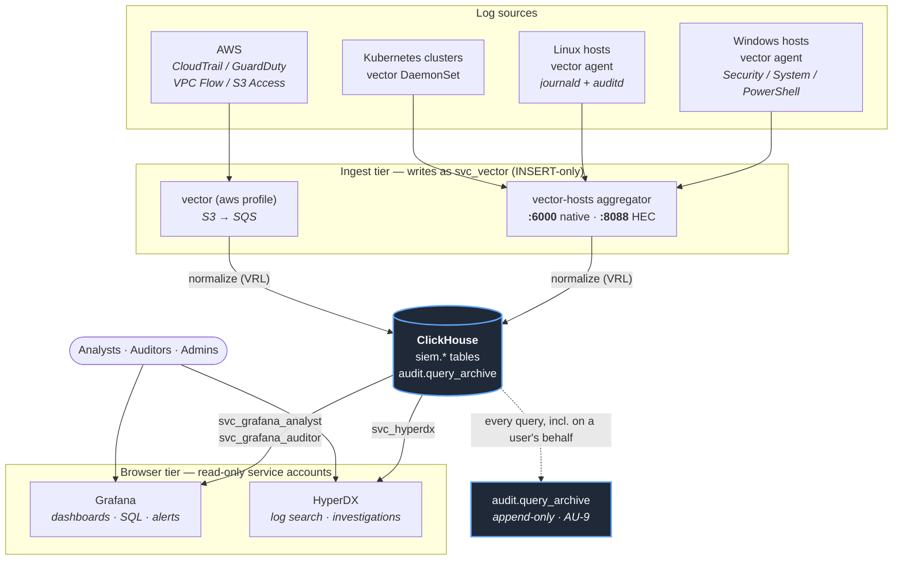

# ironlog — self-hosted SIEM

A NIST 800-53-oriented SIEM built from self-hosted components:
**ClickHouse** for storage and SQL, **Vector** for all collection, **Grafana
OSS** for dashboards and alerting, **HyperDX** for log search, with native
local accounts in each app. Keycloak integration is deferred; ironlog does
not deploy an identity provider. No ingest caps, no license keys, no
phone-home, no per-seat pricing.

The project exists because commercial/openish alternatives gate the
compliance-critical features (SSO, RBAC, audit trails, >50 GB/day) behind paid
tiers. Here, the audit evidence *is* the product: every design choice traces
to an AU-family control in [docs/control-mapping.md](docs/control-mapping.md).

## Dashboard


The weekly ISSO review dashboard (shown populated with synthetic demo data):
at-a-glance control tripwires across the top — audit-log tampering (AU-9), root
usage (AC-6), failed logons (AC-7), high-severity GuardDuty (SI-4) — then
Windows, Linux, and AWS sections covering every AU-2-committed event family,
each panel tagged with its control ID. Querying: [docs/query-guide.md](docs/query-guide.md).

## Architecture



Each UI authenticates its own local users. Finished queries and processing
errors are captured in `audit.query_archive` under shared database service
accounts, not individual app identities. Ingest happens through the write-only
`svc_vector` account; analysts can never write, auditors can also read the
analyst-activity trail.

## Components

| Service | Image (pinned) | License | Role |
|---|---|---|---|
| clickhouse | clickhouse/clickhouse-server:24.8 | Apache-2.0 | storage, SQL, RBAC, audit trail |
| grafana | grafana/grafana-oss:11.4.0 | AGPL-3.0 | dashboards, AU-5 alerting |
| hyperdx (+mongo 7.0) | docker.hyperdx.io/hyperdx/hyperdx:2.19.0 | MIT | log search / investigations UI |
| vector-hosts | timberio/vector:0.57.0-debian | MPL-2.0 | host/K8s ingestion (always on) |
| vector | timberio/vector:0.57.0-debian | MPL-2.0 | AWS ingestion (profile `aws`) |
| k3s (demo) | rancher/k3s:v1.35.6-k3s1 | Apache-2.0 | local test cluster (profile `k3s`) |

License note: MongoDB (HyperDX app-state only — no audit data) is SSPL: free
to self-host, no caps or keys, not OSI-approved; accepted and documented in
control-mapping.

## Repository layout

For RHEL 9 or builds without public internet software sources, see
[RHEL 9 and private software builds](docs/private-software-builds.md).
The same provisioners support Rocky 9 development builds; approved software
can be staged from local media or an accessible S3 bucket.

    docker-compose.yml           connected development stack
    bootstrap.sh                 fresh Compose install
    .env.example                 every secret/setting, annotated
    clickhouse/
      ddl/                       schemas, audit trail, RBAC (auto-applied on first start)
      config.d/ users.d/         listen config, query_log, default-user lockdown
      initdb/99-init.sh          applies DDL + creates service accounts
    vector/
      vector.yaml                AWS pipelines (CloudTrail/GuardDuty/VPCFlow/S3)
      hosts.yaml                 host+K8s aggregator (HEC :8088, native :6000)
      agent-linux.yaml           drop-in config for Linux hosts
      agent-windows.yaml         drop-in config for Windows hosts
      tests.yaml tests-hosts.yaml  VRL unit tests
    k8s/
      vector-shipper.yaml        DaemonSet manifest for any cluster
      k3s-demo-up.sh             one-command local demo cluster
    scripts/
      install-windows-agent.ps1  elevated Windows agent installer
      fix-windows-agent-addr.ps1 WSL-lab address fix + boot task
    grafana/provisioning/        datasources, dashboards, AU-5 alert rules
    keycloak/realm-export/       historical realm reference; not deployed
    docs/                        OKF v0.1 knowledge bundle (runbooks, policies, catalog)
    scripts/okf-validate.py      OKF conformance checker for docs/

    --- appliance build (Phase 8) ---
    packer/                      HCL2 build: RHEL 9 (shipping) / Rocky 9 (dev)
    quadlets/                    podman systemd units — the compose stack, without compose
    scripts/build-ami.sh         select one RHEL 9 or Rocky 9 builder
    scripts/prepare-artifacts.py stage local/S3 software bundles
    scripts/ami/                 software source, partitioning, baseline, STIG, FIPS, cleanup
    scripts/firstboot/           launch-time: config resolution, schema reconciliation

## UIs

| URL | What | Auth |
|---|---|---|
| http://localhost:3000 | Grafana — dashboards, SQL (Explore), alerts | Local `admin` / `IronlogDev123!` |
| http://localhost:8081 | HyperDX — log search, investigations | Local `admin@ironlog.local` / `IronlogDev123!` |

These are generic development credentials for fresh installs. Existing app
accounts are preserved. See [local authentication](docs/local-auth.md) for
configuration and upgrade instructions; no hosts-file entry is needed.

On the **appliance**, connect to `http://<appliance-host>:3000` and
`http://<appliance-host>:8081` when `APPLIANCE_TLS=false`. HTTPS URLs require
a configured TLS terminator; setting `APPLIANCE_TLS=true` does not install one.
ClickHouse (`:8123`/`:9000`) stays bound to
loopback in both deployments and is never published.

Dashboards (Grafana -> SIEM folder):
- **800-53 Logging Evidence — Weekly ISSO Review**: the weekly audit pass —
  at-a-glance posture stats (tampering, root usage, failed auth, GuardDuty),
  then Windows / Linux / AWS sections with every AU-2-committed event family,
  control IDs in each panel title.
- **AWS Security Overview**: console logins, AccessDenied trend, root
  activity, IAM writes.
- **Pipeline Health (AU-5)**: per-source ingest lag + rate.

New to querying? Start with [docs/query-guide.md](docs/query-guide.md).

## Fresh install

Run these commands from the repository root in a Bash shell.

1. Prereqs: Podman with a working Compose provider, Bash, and OpenSSL.
   Docker Engine with Compose v2 is also supported.
2. `./bootstrap.sh` — generates `.env` with generic app logins and random
   backend credentials, starts the stack, provisions the HyperDX local
   account, and verifies RBAC. An optional email argument replaces the
   default HyperDX email.
3. Open http://localhost:3000 and log in as `admin` / `IronlogDev123!`.
4. Open http://localhost:8081 and log in as `admin@ironlog.local` /
   `IronlogDev123!`. The first account seeds its ClickHouse sources.
5. Onboard data sources (next section).

Podman is the default. For Docker, run
`IRONLOG_CONTAINER_RUNTIME=docker ./bootstrap.sh`. Bootstrap records the
selection in `.env`; `scripts/compose.sh up -d`, `scripts/compose.sh logs`,
and `scripts/compose.sh down` use it for later operations. Existing Docker
installs should add `IRONLOG_CONTAINER_RUNTIME=docker` to `.env` before using
the wrapper. Switching engines does not migrate existing containers or volumes.

`podman compose` requires an external provider such as `podman-compose` or
Docker Compose. Select one with `PODMAN_COMPOSE_PROVIDER` if needed; see
[Podman's Compose documentation](https://docs.podman.io/en/latest/markdown/podman-compose.1.html).
On Windows/macOS, start a Podman machine before bootstrap. Bootstrap checks
the runtime and Compose provider before generating `.env`. The optional
privileged k3s demo uses the same runtime selection; rootless k3s operation
is not verified. Local runtime routing is covered by mocked tests; live
Podman Compose startup remains to
be verified. The EC2 appliance continues to use Podman systemd Quadlets.

`bootstrap.sh` refuses to overwrite an existing `.env`. Fully wipe with
`scripts/compose.sh down -v` (destroys data).

## Deploy as an EC2 AMI appliance

The appliance uses Podman with systemd Quadlets on **RHEL 9 for shipping**
and **Rocky Linux 9 for development**, currently on arm64. Commercial,
GovCloud, and C2S/SC2S are deployment targets; availability and compliance
must be validated in the target environment.

Container images and the Grafana ClickHouse plugin are baked into the AMI.
Builds can use public software sources or a prepared bundle containing an
RPM repository, container archives, and plugin files. Stage the bundle from
local media or any S3 bucket your credentials can read. No checksum manifest
or bucket-owner check is required. See the
[private software build guide](docs/private-software-builds.md) for bundle
layout, S3 staging, and private-network configuration.

1. Install Packer and its required plugin, then select one builder from the
   repository root:

   ```bash
   scripts/build-ami.sh --os rhel9
   # Development alternative:
   scripts/build-ami.sh --os rocky9
   ```

   For private builds, copy and customize
   `packer/rhel9-private-bundle.pkrvars.hcl.example`, then pass the resulting
   file with `-var-file=packer/rhel9-private-bundle.pkrvars.hcl`. Set
   `source_ami_id` to use your approved base image. The wrapper does not
   download Packer plugins.
2. Launch with the appliance config as **EC2 user-data** (see
   [scripts/firstboot/appliance.conf.example](scripts/firstboot/appliance.conf.example)).
   First boot **hard-fails by design** if no config is found — an unconfigured
   appliance refuses to start rather than come up with default credentials.
3. Every value is a literal, or `ssm://`, `asm://`, `file:///` (air-gapped
   enclaves), or `generate:<bytes>`. Nothing secret is baked into the AMI.
4. Use the local logins above. Account bootstrap runs after HyperDX starts;
   check its separate service result before declaring the appliance ready.

What first boot does: resolves secrets, derives the Grafana/HyperDX URLs from
`APPLIANCE_FQDN` + `APPLIANCE_TLS`, mounts the data volume at
`/var/lib/ironlog`, then reconciles the ClickHouse schema and service accounts
**on every boot** (`ironlog-schema.service`) — all DDL is
`CREATE ... IF NOT EXISTS`, and the unit fails loudly with recovery
instructions if the 7 `siem.*` tables, `audit.query_archive` and 4 service
accounts aren't all present afterwards.

Disk layout is STIG-shaped: separate LVs for `/home`, `/var`, `/var/log`,
`/var/log/audit`, `/var/tmp`, `/tmp`, with SIEM data on its own EBS volume at
`/var/lib/ironlog`. FIPS mode is enabled at build time and the build fails if
`fips=1` isn't live on the rebooted kernel.

Details: [packer/README.md](packer/README.md),
[scripts/firstboot/README.md](scripts/firstboot/README.md),
[quadlets/README.md](quadlets/README.md).

## Data source onboarding

| Source | Status here | Runbook |
|---|---|---|
| Linux hosts (journald+auditd) | agent and normalization implemented | [docs/host-ingestion.md](docs/host-ingestion.md) |
| Kubernetes (any cluster, HEC) | shipper and HEC ingestion implemented | same |
| Windows (Security/System/PowerShell) | agent and normalization implemented | same |
| AWS CloudTrail/GuardDuty/VPCFlow/S3 | staged — needs account wiring | [docs/aws-ingestion.md](docs/aws-ingestion.md) |

AWS go-live: follow the runbook (S3 -> SQS -> least-privilege IAM), fill the
Phase 2 block in `.env`, uncomment `COMPOSE_PROFILES=aws`, `scripts/compose.sh up
-d`, then un-pause the four AWS alert rules (Alerting -> AU-5 pipeline health).

## Security model

- **Authentication**: Grafana and HyperDX use separate native local accounts.
  Anonymous access is not enabled. No SSO or mandatory MFA is provided in
  this mode. Future OIDC integration will use an existing external Keycloak;
  ironlog will not deploy Keycloak or its Postgres database.
- **Authorization** (ClickHouse enforces, not the UIs):

  | Account | Can | Cannot |
  |---|---|---|
  | svc_vector | INSERT siem.* | read anything |
  | svc_grafana_analyst / svc_hyperdx | SELECT siem.* | write; read audit.* |
  | svc_grafana_auditor | SELECT siem.* + audit.* | write |
  | siem_admin (bootstrap) | everything | — |

  App roles are managed locally. Shared Grafana datasources do not enforce
  per-human analyst/auditor separation. Readers run under a settings profile: SELECT-only,
  8 GB / 120 s / 20B-rows per query.
- **Audit trail (AU-9)**: an incremental MV copies every finished query from
  system.query_log into append-only `audit.query_archive` (2-year TTL) —
  including every query Grafana and HyperDX run on anyone's behalf.
- **Network**: ClickHouse/native+HTTP bound to localhost on the host; the
  in-container `default` user is loopback-confined; ingest listeners (:6000,
  :8088) are token/marker-validated at the aggregator and write-only at the DB.
- **Secrets**: `.env` is git-ignored and mode 600. Bootstrap generates backend
  passwords; app credentials default to the documented development values.

## Compliance surface

The `docs/` directory is an [Open Knowledge Format](https://github.com/GoogleCloudPlatform/knowledge-catalog/blob/main/okf/SPEC.md)
(OKF v0.1) knowledge bundle — every doc carries YAML frontmatter (`type`,
`title`, `description`, `tags`), `docs/index.md` lists the bundle, and
`docs/log.md` tracks changes. Conformance is enforced by
`python3 scripts/okf-validate.py docs` (start at [docs/index.md](docs/index.md)).

- [docs/control-mapping.md](docs/control-mapping.md) — control -> artifact map (auditor-facing)
- [docs/event-catalog.md](docs/event-catalog.md) — the AU-2 commitment; VRL implements exactly this
- [docs/retention-policy.md](docs/retention-policy.md) — AU-11 numbers (DRAFT: total-retention needs confirmation)
- [docs/query-guide.md](docs/query-guide.md) — analyst quick-start for HyperDX + Grafana
- AU-5: provisioned alert rules fire on source silence (per-table thresholds),
  and on ClickHouse being unreachable (NoData/Error -> alerting). Notifications
  route to the `siem-oncall` contact point — set a real address + SMTP.

## Operations

- **Start/stop**: `scripts/compose.sh up -d` / `scripts/compose.sh down` (add
  `--profile aws --profile k3s` to include optional services). For appliance services, use systemd; see
  [Quadlet operations](quadlets/README.md).
- **Weekly ISSO pass**: open the 800-53 dashboard, review each section (red
  stats first), check Alerting for anything firing, spot-check
  `audit.query_archive` via the audit-trail datasource.
- **VRL changes**: edit vector/*.yaml, run the unit tests, restart the service:

      podman run --rm -v "$PWD/vector:/cfg:ro,z" -e AWS_REGION=x \
        -e SQS_URL_CLOUDTRAIL=x -e SQS_URL_GUARDDUTY=x -e SQS_URL_VPCFLOW=x \
        -e SQS_URL_S3ACCESS=x -e CH_VECTOR_PASSWORD=x \
        docker.io/timberio/vector:0.57.0-debian test /cfg/vector.yaml /cfg/tests.yaml
      podman run --rm -v "$PWD/vector:/cfg:ro,z" -e SPLUNK_HEC_TOKEN=x \
        -e CH_VECTOR_PASSWORD=x \
        docker.io/timberio/vector:0.57.0-debian test /cfg/hosts.yaml /cfg/tests-hosts.yaml

- **Account recovery**: local app accounts persist in Grafana/MongoDB data.
  Changing initial-account environment values does not reset existing users.
  See [local authentication](docs/local-auth.md).
- **Version bumps**: images are pinned; bump deliberately, one at a time, and
  re-run the vector unit tests + a bootstrap on a scratch host before fleet
  changes.
- **Windows idle-freeze pilot** (vector#25194): the AU-5 Windows rule is the
  tripwire. If it fires while the host is active and the service is Running:
  `Restart-Service vector` (agent disk buffers prevent loss).

## Field notes / troubleshooting

Hard-won lessons encoded in this repo — check here before debugging:

- **ClickHouse in docker listens on loopback only** by default; other
  containers can't reach it. `config.d/05-listen.xml` sets 0.0.0.0 (`::`
  crashes on IPv6-less compose networks, exit 210).
- **Never mount users.d read-only over the whole directory** — the image
  entrypoint must write default-user.xml there (crash loop otherwise). Mount
  individual files.
- **Vector >= 0.57 does not interpolate `${VAR}` in configs by default.**
  Set `VECTOR_DANGEROUSLY_ALLOW_ENV_VAR_INTERPOLATION=true` (compose sets it;
  agents need it too). Interpolation is pre-parse text substitution, so a
  dollar-brace reference **even inside a comment** aborts config load.
- **Vector's clickhouse sink healthcheck probes without auth** and 403s
  against the locked-down default user — sink healthchecks are disabled in
  our configs; inserts are authenticated and unaffected.
- **Windows services can't use the WSL2 localhost relay** (interactive
  sessions only). Agents on the docker host must target the WSL NAT IP —
  `scripts/fix-windows-agent-addr.ps1 -Register` keeps it correct per boot.
- **PowerShell scripts must stay pure ASCII**: PowerShell 5.1 reads BOM-less
  UTF-8 as ANSI; an em-dash becomes a smart quote and kills parsing.
- **Pods inside in-docker k3s can't resolve docker DNS names** (k3s swaps
  loopback resolvers for a public one) — `k8s/k3s-demo-up.sh` patches the
  shipper endpoint to the aggregator IP.
- **HyperDX DEFAULT_CONNECTIONS/DEFAULT_SOURCES seed only when the first user
  registers**, and malformed JSON is skipped silently.
- **ClickHouse's docker entrypoint runs `/docker-entrypoint-initdb.d` only when
  the data directory is empty.** A container that dies partway through init
  leaves a non-empty `metadata/` and the DDL is then skipped *forever* on every
  subsequent start — a healthy-looking server with no schema. `SELECT 1`
  healthchecks pass against an empty database, so nothing downstream notices;
  this is why the appliance reconciles the schema as a separate gated unit.
- **ClickHouse 24.8 rejects `REFRESH ... APPEND` MVs** (newer + experimental);
  the audit trail uses a standard incremental MV instead. `system.query_log`
  doesn't exist until first flush — DDL runs `SYSTEM FLUSH LOGS` first.
- WSL idle-shutdown stops the stack between sessions; the boot task (or any
  open WSL shell) keeps it alive.

## Roadmap

- **Phase 5 (remaining)**: S3 tiering for ClickHouse (config staged at
  `config.d/20-storage-s3.xml.disabled`), Object Lock raw archive (Parquet via
  aws_s3 sink), query_archive export. Retention numbers pending confirmation
  in retention-policy.md. AU-5 alerting: DONE.
- **Phase 6**: detection SQL + alert rules per control family (`detections/`).
- **Phase 7**: operational cadence — review checklists, evidence exports,
  annual catalog review.
- **Phase 8 (in progress)**: EC2 AMI appliance. Build pipeline, quadlets,
  first-boot config resolution and schema reconciliation have historical
  real-hardware validation (cold boot, FIPS, end-to-end ingest, RBAC).
  The new local-auth deployment still needs a fresh live boot. Outstanding:
  first RHEL 9 build for real compliance evidence, TLS termination, and
  offline Grafana plugin staging. External Keycloak integration is deferred;
  the current default uses local app accounts.

## Known issues

- **Offline Grafana startup** still needs the ClickHouse plugin staged at
  build time; see `quadlets/README.md`.
- **Existing app databases** retain their credentials. Generic defaults do
  not reset accounts; see [local authentication](docs/local-auth.md).
- **Packer leaks one 100 GiB volume per build** — the builder's `/dev/sdb`
  carries `delete_on_termination = false` in `packer/sources.pkr.hcl`. Fixing
  it needs an explicit `ami_block_device_mappings`, because `CreateImage`
  otherwise copies the flag onto every launched appliance's data volume.
